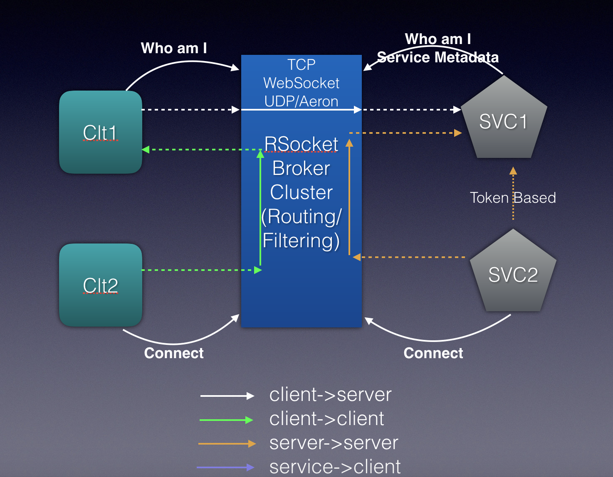

Alibaba RSocket Broker
======================
[](https://repo1.maven.org/maven2/com/alibaba/rsocket/)
[](https://github.com/alibaba/alibaba-rsocket-broker/issues)
[](https://travis-ci.com/alibaba/alibaba-rsocket-broker)
[](https://www.apache.org/licenses/LICENSE-2.0.txt)
&nbsp;&nbsp;&nbsp;&nbsp;
[](https://github.com/alibaba/alibaba-rsocket-broker/blob/master/README.md)


Alibaba RSocket Broker is a communication system between broad range of applications using RSocket protocol. RSocket is an application protocol that carries the reactive semantics. 

The design highlights of the broker are:
* Reactive: focuses on asynchronous, non-blocking communication
* Programmable: act as control plane
* Message driven
* Zero copy: Fast routing 

For more information on the use cases of Alibaba RSocket broker, please visit [here](http://rsocketbyexample.info).


## Under the hood
The broker will listen to traffic. For an application, whether it is providing or requesting service, will connect to the broker as a client.

When connecting to the broker, the application will identify itself and provide service meta data if it plans to serve the others. Broker will use this information to build service registry.
As requests come in for services, the broker will analyse the header and try to match it with the information in the registry. At this step users can also plugin their own load balancing mechanism. Since RSocket is a binary protocol, the broker can achieve the routing functionality with zero-copy of the messages. 
On top of that, RSocket is a reactive protocol, which means the whole process is asynchronous and non-blocking, ensuring the high performance of the broker.

Not only can Alibaba RSocket broker route traffic, but it can simplify micro services orchestration tasks:

* Config server: RSocket has a feature called metadataPush. Using the broker as centralized config server, the config information can be targeted to the applications.
* Service discovery: RSocket connections are long connections. Combined with the registry function mentioned above, there is no need for 3rd party tools.
* Multiplex: RSocket broker only needs to maintain one connection to each application. Whether it's requesting or responding, or serving multiple api calls, this one connection is good handle all the situation.
* Load balancing: The broker has all the connection information. The users can build complicated LB algorithms on top of it.
* Circuit breaker: Reactive systems use back pressure to achieve the same feature.
* Polyglot: Since RSocket is a protocol, all major programming languages have SDKs supporting it.


## Components
The Alibaba RSocket broker is written in Spring Framework. It has the following components:

  * alibaba-rsocket-service-common: RSocket Service Interface support, include RX framework, annotations and support classes.
  * alibaba-rsocket-core: Alibaba's implementation of RSocket spec
  * alibaba-rsocket-spring-boot-starter: Spring Boot Starter for RSocket, Service registration and discovery
  * alibaba-broker-spring-boot-starter: Spring Boot Starter for RSocket Broker, makes it easier for others to add on to
  * alibaba-broker-server: Alibaba RSocket Broker, including Dashboard and other features 
  * alibaba-broker-registry-client-spring-boot-starter: The client when using RSocket Broker as registry
  * alibaba-broker-config-client-spring-boot-starter: The clint when using the broker as config server
  * rsocket-broker-http-gateway: A gateway that translates RSocket and HTTP

## Prerequisite

To run or contribute to Alibaba RSocket broker, the following is required:

* JDK 1.8.0+
* Maven 3.5.x
* Node 10+: RSocket Broker uses Vaadin 14 to build the dashboard. Node 10 or above is needed to support Vaadin.

## Run the examples 
There are two parts of the application: the requester and the responder. Both are Spring boot applications. Plus, we need a common module for both parts.
```
git clone https://github.com/alibaba/alibaba-rsocket-broker
cd alibaba-rsocket-broker

```
From here we need to build the packages. Please **DO NOT USE IDEs** since there are resources needed that cannot be built from IDEs.
Now run in terminal:
```
mvn -DskipTests clean package
```
         
Next you'll start the broker locally.

`./startup.sh`

To shutdown the broker:

`./shutdown.sh`

Enter the example directory:   
`cd example`    
Now start the responder:      
`java -jar rsocket-responder/target/rsocket-responder-1.0.0-SNAPSHOT.jar`   
And the requester:      
`java -jar rsocket-requester/target/rsocket-requester-1.0.0-SNAPSHOT.jar`   
Next query the requester, which will relay the request to responder:      
`curl http://localhost:8181/user/2`    
And you should see the response.  

## Write your own RSocket requester and responder

First create a remote interface:

```
public interface UserService {
    Mono<User> findById(Integer id);
}
```
Implement the feature on the responder side. Add an `@RSocketService` annotation：

```
@RSocketService(serviceInterface = UserService.class)
@Service
public class UserServiceImpl implements UserService {
    @Override
    public Mono<User> findById(Integer id) {
        return Mono.just(new User(1, "nick:" + id));
    }
}
```
And you may now invoke the service remotely.

On the requester side，create a Spring bean that matches the interface:
```
 @Bean
    public UserService userService(@Autowired UpstreamManager upstreamManager) {
        return RSocketRemoteServiceBuilder
                .client(UserService.class)
                .upstreamManager(upstreamManager)
                .build();
    }
```

To provide access to end users, create a REST api on the requester side:

```
@RestController
public class PortalController {
    @Autowired
    UserService userService;

    @GetMapping("/user/{id}")
    public Mono<User> user(@PathVariable Integer id) {
        return userService.findById(id);
    }
}
```

## References

* [RSocket](http://rsocket.io/)
* [RSocket Java](https://github.com/rsocket/rsocket-java)
* [RSocket with Spring Boot](https://docs.spring.io/spring-boot/docs/current/reference/htmlsingle/#boot-features-rsocket)
* [Project Reactor](http://projectreactor.io/)
* [Reactive Foundation](https://reactive.foundation/)


