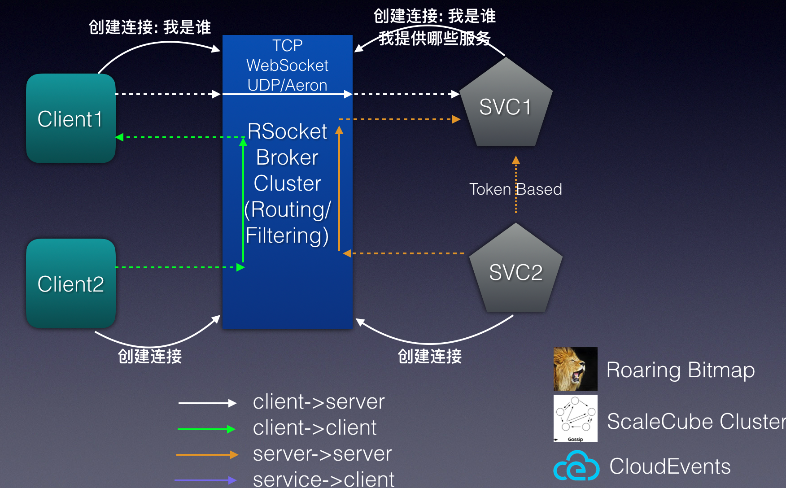

Alibaba RSocket Broker
======================
Alibaba RSocket Broker是一款基于RSocket协议的响应式程控消息交换系统，为通讯双方构建一个透明稳健的通讯桥梁。

* 响应式: 编程模型、线程模型、异步化、无网络要求等
* 程控：程序控制，可定制，如扩展支持等
* 消息：面向消息通讯，路由、过滤、observability都非常简单
* 交换系统：分布式、异构系统支持



### 项目模块

* alibaba-rsocket-core: RSocket核心功能模块
* alibaba-rsocket-spring-boot-starter: Spring Boot Starter for RSocket, 包括RSocket服务发布和消费
* alibaba-broker-spring-boot-starter: Spring Boot Starter for RSocket Broker, 方便第三方进行扩展
* alibaba-rsocket-broker: Alibaba RSocket Broker参考实现
* alibaba-broker-registry-client-spring-boot-starter: 通过RSocket Broker对外提供服务发现服务
* alibaba-broker-config-client-spring-boot-starter: 通过RSocket Broker对外提供配置推送服务
* rsocket-broker-gateway-http: RSocket Broker HTTP网关，将HTTP转换为RSocket协议

### 如何运行Example

项目提供了RSocket Broker Example，你可以在example模块下找到。以下是如何在IDE中运行样例的步骤：

* 找到AlibabaRSocketBrokerServer类，运行main函数，启动RSocket Broker
* 找到RSocketResponderServer类，运行main函数，启动RSocket Responder对外提供Reactive服务
* 找到RSocketRequesterApp类，运行main函数，启动RSocket Requester, 进行Reactive Service消费
* 在IDEA中，找到example.http，运行 "GET http://localhost:8181/user/2" 或者运行以下命令，进行服务调用测试。

```
$ curl http://localhost:8181/user/2
```

### RSocket服务编写流程
包含如何创建一个Reactive服务接口，在Responder端实现该接口，在Requester完成Reactive服务调用。

* 创建一个RSocket服务接口，你可以创建一个单独的Maven Module存放这些接口，如user-service-api，样例代码如下：

```
public interface UserService {
    Mono<User> findById(Integer id);
}
```

* 在RSocket Responder端实现该接口，同时给实现类添加 @RSocketService annotation，如下：

```
@RSocketService(serviceInterface = UserService.class)
public class UserServiceImpl implements UserService {
    @Override
    public Mono<User> findById(Integer id) {
        return Mono.just(new User(1, "nick:" + id));
    }
}
```

* 在RSocket Requester，以Proxy方式创建Reactive服务接口对应的Spring bean, 如下：

```
    @Bean
    public UserService userService(@Autowired UpstreamManager upstreamManager) {
        return RSocketRemoteServiceBuilder
                .client(UserService.class)
                .upstreamManager(upstreamManager)
                .build();
    }
```

* 在RSocket Requester端，进行代码调用，如HTTP REST API提供给:

```
@RestController
public class PortalController {
    @Autowired
    UserService userService;

    @GetMapping("/user/{id}")
    public Mono<User> user(@PathVariable Integer id) {
        return userService.findById(id);
    }
}
```


### References

* RSocket: http://rsocket.io/
* RSocket Java: https://github.com/rsocket/rsocket-java
* RSocket with Spring Boot: https://docs.spring.io/spring-boot/docs/current/reference/htmlsingle/#boot-features-rsocket
* Reactor: http://projectreactor.io/
* RSocket Protocol: https://github.com/rsocket/rsocket/blob/master/Protocol.md
